<div align="center">
  
  <h1>Traveloop</h1>
  <p><em>Sun-Baked Simplicity for trip planning, itineraries, budgets, notes, and shared travel experiences.</em></p>
  <p><strong>Built for the Odoo Hackathon</strong></p>
</div>

Traveloop is a comprehensive travel planning platform for multi-city trips. It brings trip creation, stop planning, activities, budgets, packing lists, notes, and public sharing into one warm, minimal interface.

## Features

- Multi-city trip planning with saved stops
- Dynamic itinerary builder with live database persistence
- City and activity discovery
- Budget and expense tracking
- Packing checklist management
- Trip notes and travel journal
- Public trip sharing and copy flow
- JWT-based authentication

## Tech Stack

<div align="center">
  
</div>

### Frontend
- React 18
- React Router DOM
- Vite
- Custom warm-minimal design system using Manrope and Cormorant Garamond

### Backend
- Node.js
- Express.js
- PostgreSQL
- JWT authentication
- bcryptjs password hashing

## Design Philosophy

Traveloop uses a warm editorial visual language:

- Earthy color palette with soft contrast
- Large typography and generous whitespace
- Soft shadows and rounded surfaces
- Calm, travel-focused interface patterns

## Screenshots

### Authentication

<table>
  <tr>
    <td align="center">
      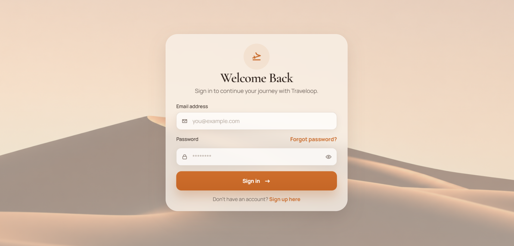
      <br /><strong>Login</strong>
    </td>
    <td align="center">
      
      <br /><strong>Sign Up</strong>
    </td>
  </tr>
</table>

### Core Dashboard

<table>
  <tr>
    <td align="center">
      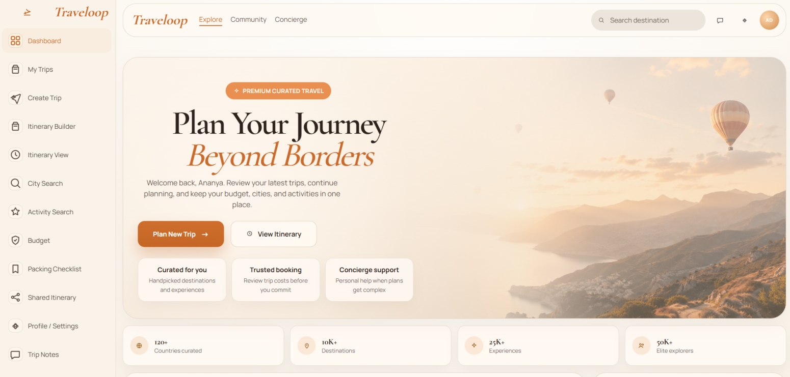
      <br /><strong>Dashboard</strong>
    </td>
    <td align="center">
      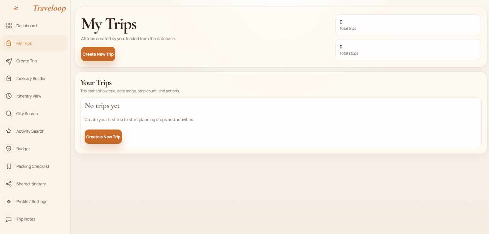
      <br /><strong>My Trips</strong>
    </td>
  </tr>
</table>

### Planning Workflow

<table>
  <tr>
    <td align="center">
      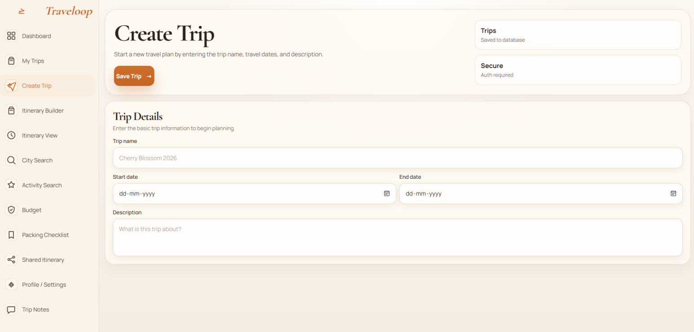
      <br /><strong>Create Trip</strong>
    </td>
    <td align="center">
      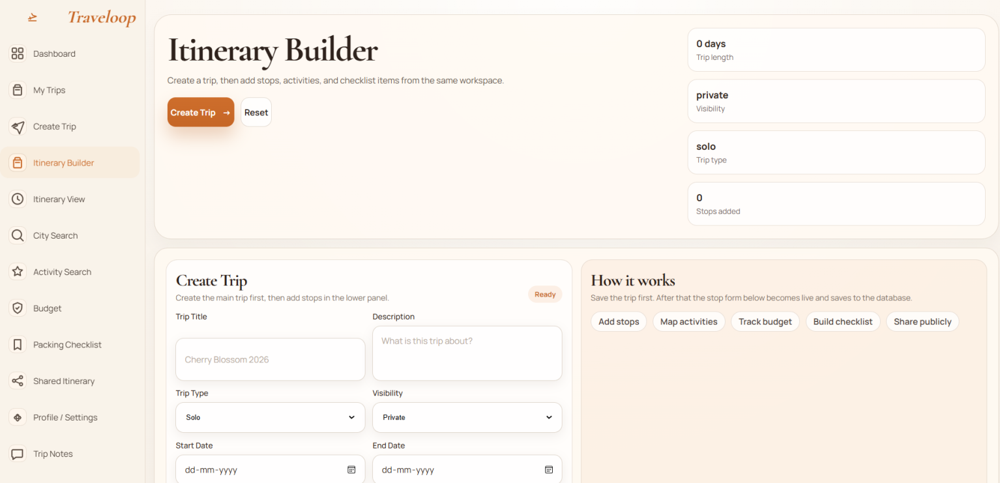
      <br /><strong>Itinerary Builder</strong>
    </td>
  </tr>
  <tr>
    <td align="center">
      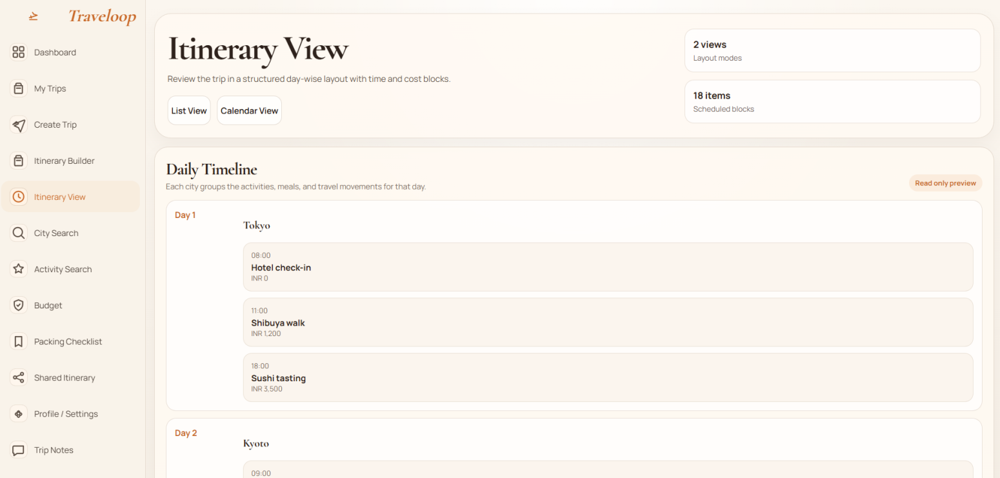
      <br /><strong>Itinerary View</strong>
    </td>
    <td align="center">
      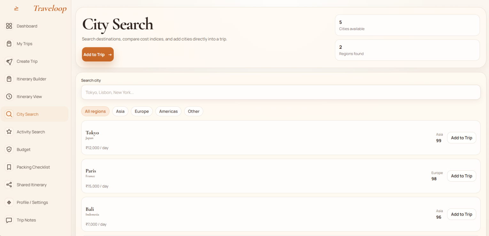
      <br /><strong>City Search</strong>
    </td>
  </tr>
</table>

### Additional Screens

<table>
  <tr>
    <td align="center">
      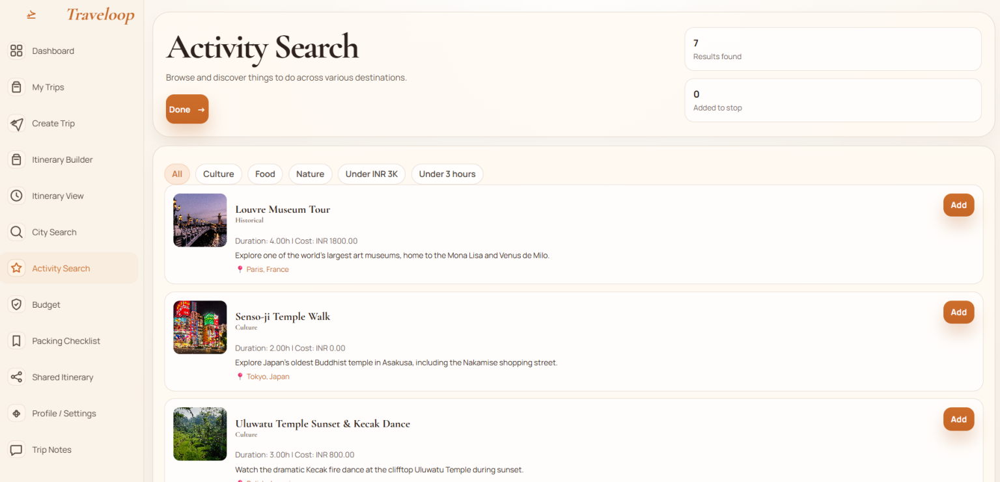
      <br /><strong>Activity Search</strong>
    </td>
    <td align="center">
      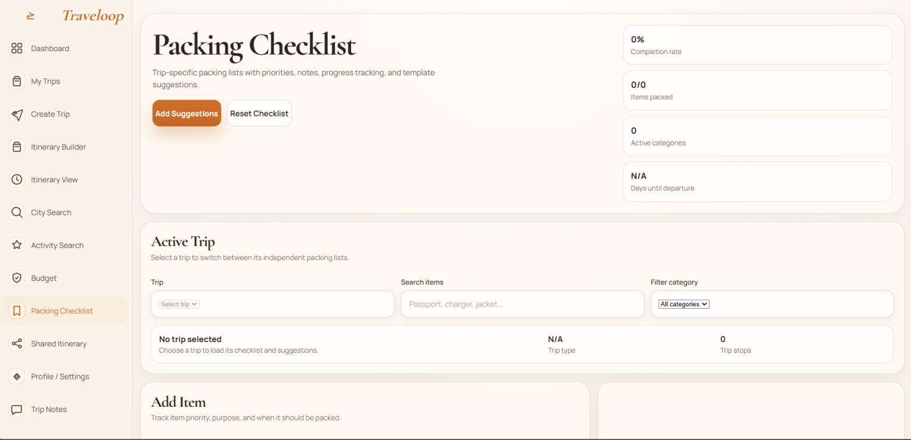
      <br /><strong>Packing Checklist</strong>
    </td>
  </tr>
  <tr>
    <td align="center">
      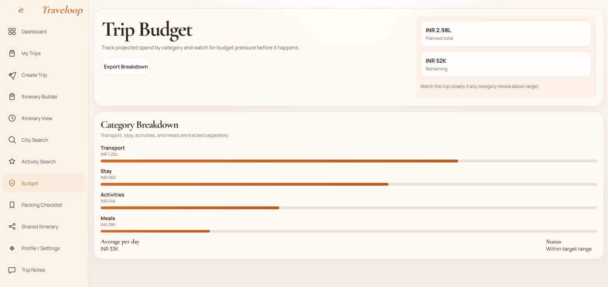
      <br /><strong>Budget</strong>
    </td>
    <td align="center">
      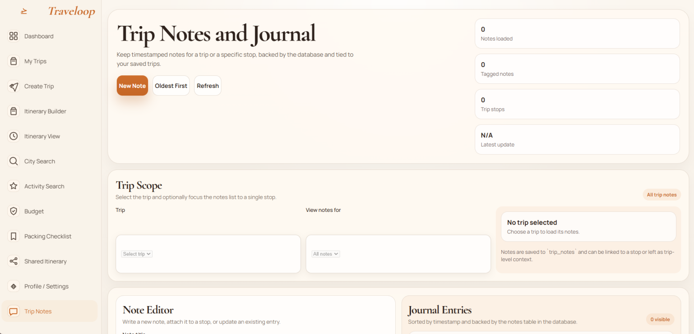
      <br /><strong>Trip Notes</strong>
    </td>
  </tr>
  <tr>
    <td align="center">
      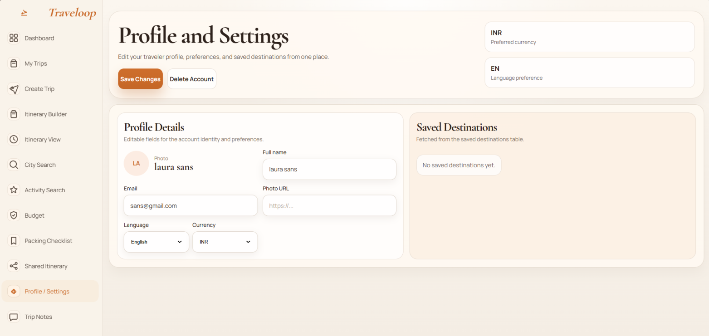
      <br /><strong>Profile and Settings</strong>
    </td>
    <td align="center">
      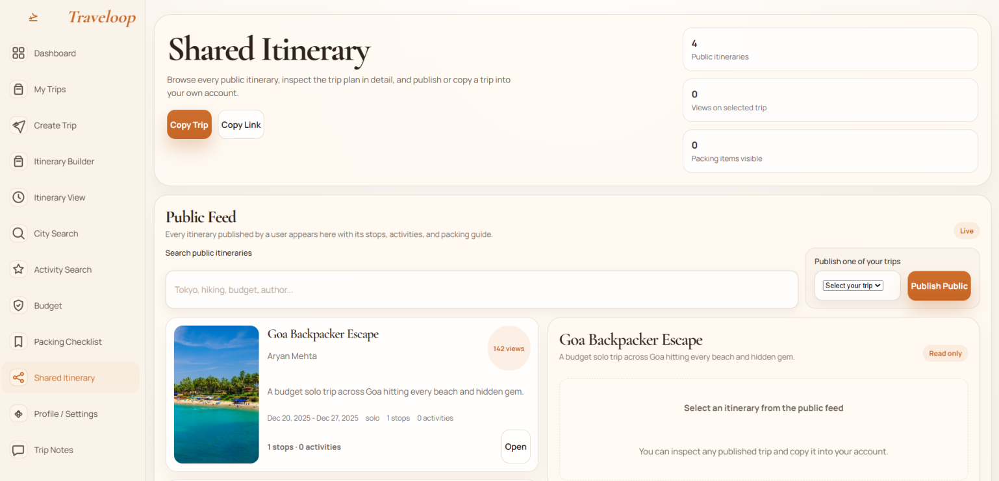
      <br /><strong>Shared Itinerary</strong>
    </td>
  </tr>
</table>

## Getting Started

### Prerequisites

- Node.js 18+
- PostgreSQL database

### Installation

1. Clone the repository
   ```bash
   git clone <repository-url>
   cd Odoo-Traveloop2026
   ```

2. Set up the database
   ```bash
   psql -U your_username -d your_database -f schema.sql
   ```

3. Start the backend
   ```bash
   cd backend
   npm install
   # Create a .env file with your database credentials and JWT_SECRET
   npm run dev
   ```

4. Start the frontend
   ```bash
   cd frontend
   npm install
   npm run dev
   ```

5. Open the app
   - Visit `http://localhost:5173`

## Project Notes

- The frontend is connected to the backend APIs and PostgreSQL database.
- Trip creation, stop management, checklist, notes, and sharing are all data-driven.
- The screenshots in `screen_images/` are included for GitHub presentation and documentation.

---

<div align="center">
  Built with care for the Odoo Hackathon.
</div>
